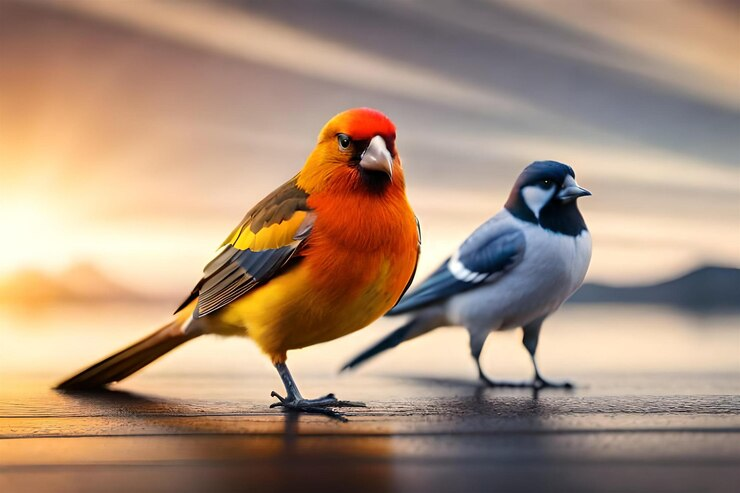

# Aula Prática - 10 - Prática Integradora Desenvolvimento de Apps

## Descrição
Esta prática consistiu em criar e gerenciar um repositório no GitHub utilizando o sistema de controle de versão Git. O objetivo foi aprender sobre o processo de versionamento, colaboração e a estrutura básica de um projeto web.

## Objetivos
- Aprender a usar o Git para controle de versão.
- Criar um repositório no GitHub e integrá-lo ao projeto local.
- Realizar operações básicas como commit, push e pull.
- Adicionar arquivos ao projeto e atualizá-los no repositório remoto.

## Etapas Realizadas

### 1. Criação do Repositório no GitHub
- Acesse o GitHub e criei um novo repositório chamado `pa-10-pida`.
- Inicializei o repositório com um arquivo `README.md`.

### 2. Configuração do Projeto Local
- Criei uma pasta chamada `pa-10-pida` em meu computador.
- Dentro dessa pasta, criei um arquivo chamado `index.html` com o seguinte conteúdo básico:

```html
<!DOCTYPE html>
<html lang="pt-BR">
<head>
    <meta charset="UTF-8">
    <meta name="viewport" content="width=device-width, initial-scale=1.0">
    <title>Aula 10 - Prática Integradora Desenvolvimento de Apps</title>
</head>
<body>
    <center>
    <h1>Bem-vindo ao meu projeto!</h1>
    <br><br>
    
    </center>
</body>
</html>
```

### 3. Conexão do Repositório Local com o GitHub
- Inicializei o Git na pasta do projeto com o comando git init.
- Conectei o repositório local ao repositório remoto no GitHub utilizando:

```bash
git remote add origin https://github.com/coutojw/pa-10-pida.git
```

### 4. Adição e Commit de Alterações
Adicionei o arquivo index.html ao controle de versão e fiz um commit:

```bash
git add index.html
git commit -m "Adiciona arquivo index.html inicial"
```
### 5. Push para o Repositório Remoto
Enviei as alterações para o repositório no GitHub com:

```bash
git push -u origin main
```
### 6. Adição de Imagens ao Projeto
Criei uma pasta chamada images dentro do projeto.
Escolhi uma imagem respeitando os direitos autorais e a salvei na pasta images.
Atualizei o index.html para incluir a imagem:

```html

```